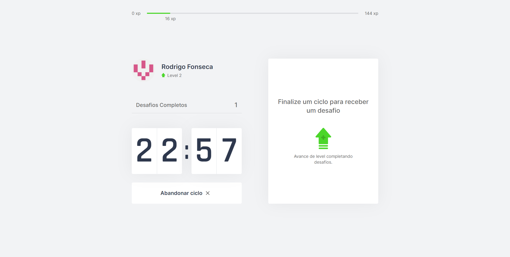
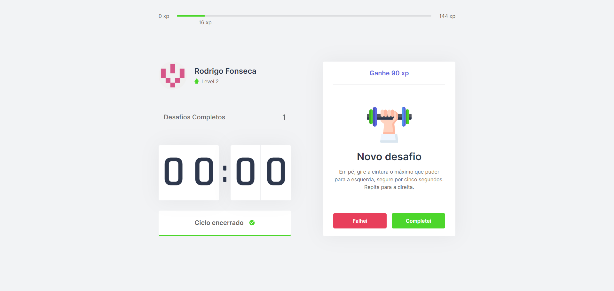
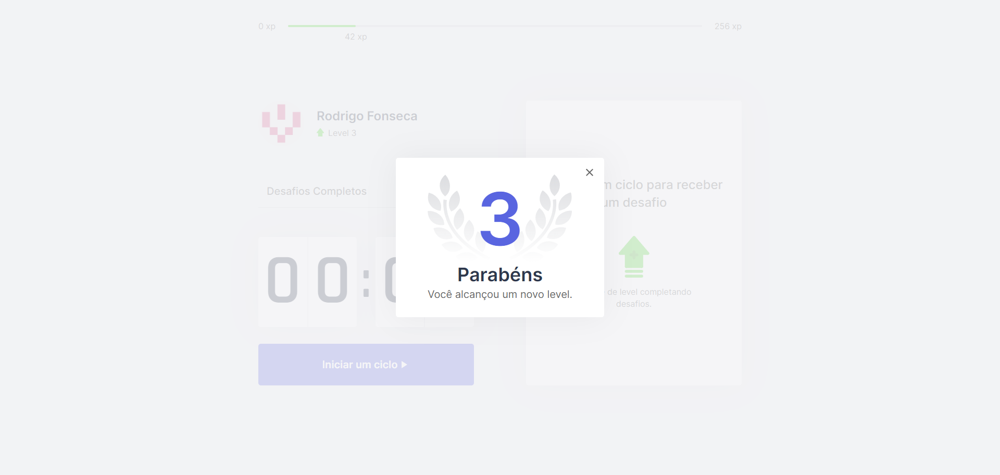

# Moveit

## 📝 Sobre

**Moveit** é uma aplicação que une a técnica de Pomodoro com a realização de exercícios físicos para quem passa muito tempo na frente do computador.

O site possui sistema de experiência e level que evoluem de acordo com a realização de desafios pelo usuario.


Futuras implementações:
-
-
-

---------

## 🖥️ Demonstração

<h1>
     
  
<h1>
     
  
<h1>
     

----------


## 🚀 Tecnologias e ferramentas utilizadas

- **React**
- **TypeScript**
- **NextJS**
- **js-cookies**

---------

## 💻 Instalação e uso

```bash
# Abra um terminal e copie este repositório com o comando
$ git clone https://github.com/RodrigoFonsecaG/moveit.git
# ou use a opção de download.

# Entre na pasta do projeto 
$ cd moveit

# Instale as dependências
$ npm install

# Rode o aplicação
$ npm run dev

#Por fim acesse o localhost:3000 no seu navegador.
```

-----------
